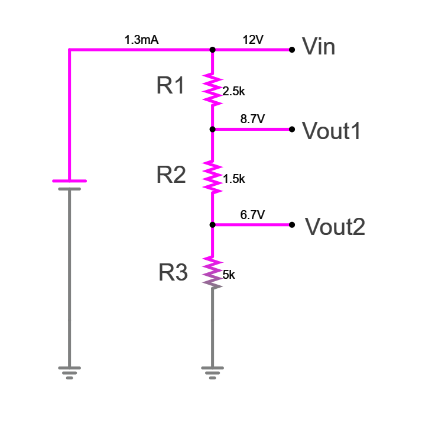

## 🔋 3-Resistor Voltage Divider Calculator

This calculator determines resistor values, total current, and power dissipation for a 3-resistor voltage divider circuit based on the input voltage and two output voltages (taps).

### ⚡ Circuit Diagram

```
Vin --- R1 ---+--- R2 ---+--- R3 --- GND  
              |          |
           Vout1      Vout2
```

### 🧮 Python Code

```python
def solve_3_resistor_divider(Vin, Vout1, Vout2, R3=5000):
    """
    Solves for R1, R2 in a 3-resistor divider given Vin, Vout1, Vout2, and R3.
    Also calculates total current and power dissipated by each resistor.

    Returns:
    - Tuple: (R1, R2, R3, I_total, P_R1, P_R2, P_R3)
    """
    # Calculate total resistance from Vout2
    R_total = R3 * Vin / Vout2

    R1 = R_total * (Vin - Vout1) / Vin
    R2 = R_total - R1 - R3

    # Current from the source
    I_total = Vin / (R1 + R2 + R3)

    # Power dissipated in each resistor
    P_R1 = I_total ** 2 * R1
    P_R2 = I_total ** 2 * R2
    P_R3 = I_total ** 2 * R3

    return R1, R2, R3, I_total, P_R1, P_R2, P_R3

# Example usage
Vin = 12.0
Vout1 = 8.7
Vout2 = 6.7

R1, R2, R3, I, P1, P2, P3 = solve_3_resistor_divider(Vin, Vout1, Vout2)

print(f"Input Voltages:")
print(f"  Vin    = {Vin:.4f} V")
print(f"  Vout1  = {Vout1:.4f} V")
print(f"  Vout2  = {Vout2:.4f} V\n")

print(f"Resistor values:")
print(f"  R1 = {R1:.4f} Ω")
print(f"  R2 = {R2:.4f} Ω")
print(f"  R3 = {R3:.4f} Ω\n")

print(f"Total current from source: {I*1000:.4f} mA")

print(f"Power dissipated:")
print(f"  P_R1 = {P1:.4f} W")
print(f"  P_R2 = {P2:.4f} W")
print(f"  P_R3 = {P3:.4f} W")
```

---

### 🧾 Example Output:

```
Input Voltages:
  Vin    = 12.0000 V
  Vout1  = 8.7000 V
  Vout2  = 6.7000 V

Resistor values:
  R1 = 2500.0000 Ω
  R2 = 1500.0000 Ω
  R3 = 5000.0000 Ω

Total current from source: 1.3333 mA

Power dissipated:
  P_R1 = 0.0044 W
  P_R2 = 0.0027 W
  P_R3 = 0.0089 W
```
### 💿📊 Simulation Output:


[www.falstad.com](https://www.falstad.com/circuit/)

```
$ 1 0.000005 10.20027730826997 50 5 43 5e-11
v 112 352 112 80 0 0 40 12 0 0 0.5
g 112 352 112 400 0 0
r 256 80 256 160 0 2500
r 256 160 256 256 0 1500
r 256 256 256 352 0 5000
g 256 352 256 400 0 0
w 256 80 112 80 1
w 256 160 336 160 2
w 256 256 336 256 2
w 256 80 336 80 2
x 199 124 229 127 4 24 R1
x 199 214 229 217 4 24 R2
x 201 312 231 315 4 24 R3
x 349 266 410 269 4 24 Vout2
x 346 170 407 173 4 24 Vout1
x 346 85 380 88 4 24 Vin

```
